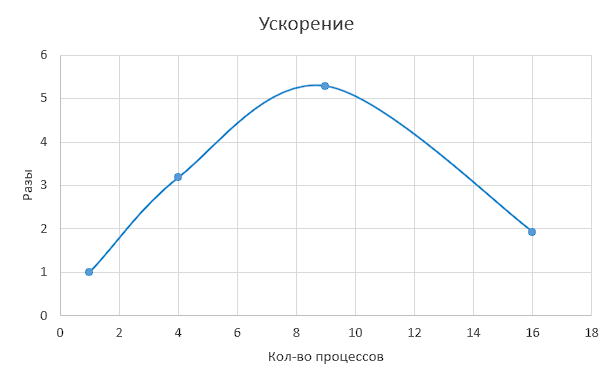
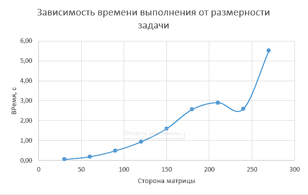

<h1 align="center">
Thread lab 2
</h1>

Все замеры проводились на процессоре с 6 физическими ядрами и 12 потоками. 
Выполнили: Козин Борис (21пи-3), Столетов Максим (21пи-2), Гурьянов Илья (21пми-1)

## Задание 1 (Умножение матрицы на вектор разными алгоритмами)

Во всех алгоритмах данные распределяются между процессами, а в конце собираются обратно на 0 процессе.

### Описание первого алгоритма

.jpg)

В первом алгоритме матрица разбивается по строкам. Строки распределяются поровну между процессами,
за исключением последнего - ему достаются оставшиеся строки, если их число не поделилось на кол-во процессов.

### Оценка работы алгоритма

|  |  |
|:-------------------------:|:-------------------------:|
|  |  |

---

### Описание второго алгоритма

.jpg)

Во втором алгоритме матрица разбивается по столбцам. Разбиение происходит аналогично предыдущему алгоритму,
только работа ведется со столбцами.

### Оценка работы алгоритма

|  |  |
|:-------------------------:|:-------------------------:|
|  |  |

---

### Описание третьего алгоритма

.jpg)

В третьем алгоритме матрица разбивается на блоки. Для этого алгоритма число процессов должны быть полным квадратом.
Каждый процесс работает со своим блоком, размером в $\frac{N}{\sqrt{p}} * \frac{M}{\sqrt{p}}$, где $p$ - число
процессов, $N$ и $M$ - размеры матрицы. Если размер матрицы не поделился на цело на $\sqrt{p}$, то некоторые процессы
получают блоки большего размера, чтобы покрыть всю матрицу.

### Оценка работы алгоритма

|   |  |
|:--------------------------:|:--------------------------:|
|  |  |

## Задание 2 (Перемножение матриц алгоритмом Кэнона)

Этот алгоритм параллельного умножения матриц минимизирует количество необходимых операций за счет использования каналов
связи между процессорами, эффективно распределяя данные и вычисления.

Изначально из процессов формируется виртуальная квадратная сетка, каждый элемент которой получает одинаковый по
размеру блок. После этого процессы перемещают свои блоки по горизонтали и вертикали, влево вверх, пока каждый процесс не
получит все нужные блоки для вычислений.

В конце произведение матриц получается из этих блоков.

### Оценка работы алгоритма

|  |  |
|:--------------------------:|:--------------------------:|
|  |  |

## Задание 3 (Решение задачи Дирихле)

<b> Задача Дирихле </b>— это краевая задача для эллиптических дифференциальных уравнений, где на границе области
задаются постоянные значения функции. В начале решения происходит дискретизация области и задание сетки случайными
числами. Решение в узловых точках сетки получается через итерационный процесс: вычисляются новые значения на сетке, 
пока они не стабилизируются.

### Описание сходимости

* Во-первых, точность, предложенная в учебнике, мала, даже для сходимости небольшого числа точек, не говоря о
  предложенных 5000 точек. Поэтому мы использовали свою.
* Во-вторых, из-за особенностей алгоритма и тестового стенда использовать число процессов больше, чем число потоков в
  процессоре на столько не целесообразно, что при 9 процессах задача выполняется полсекунды, а 16 - более 10 минут
  (измерения не были доведены до конца).

|  <figcaption>Точность из учебника</figcaption> |  <figcaption>Предложенная нами точность</figcaption> |
|:----------------------------------------------------------------------------:|:------------------------------------------------------------------------------:|

### Оценка работы алгоритма

|  |  |
|:--------------------------:|:--------------------------:|
|  |  |

## Анализ полученных результатов

* **Ускорение**: Ускорение программы незначительно увеличивалось с ростом числа процессов, что свидетельствует о
  преимуществе распределенных вычислений. Однако после 6-8 процессов увеличение ускорения прекратилось из-за исчерпания
  аппаратных ресурсов.
* **Эффуктивность**: Максимальная эффективность при распараллеливании наблюдалась при 1 процессе. Эффективность
  использования ресурсов падала по мере увеличения их числа.

## Заключение

Использование распределенных вычислений позволяет ускорить выполнение программы. Оптимальное количество процессов не 
превышает количество ядер процессора, также дальнейшее увеличение числа процессов приносит минимальное ускорение.  

---

Напоследок, хочется поблагодарить функцию `MPI_Reduce`, которая ломала код на протяжении всего процесса разработки. В 
честь чего наша команда посвящает ей [данную песню](https://suno.com/song/77926302-65fb-4d8d-aeae-12717d906288).  

:heart: MPI_Reduce :heart:

